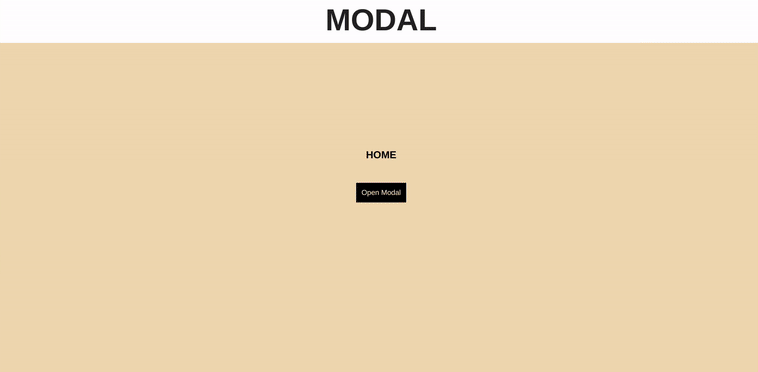

### CREATING MY FIRST MODAL

#### I ve been looking for a simple modal and i think this version is the easiest one,as you can also find really cool but a bit difficult with Framer Motion.

<br>

[](https://nadiamariduena.github.io/animated-portfolio-with-intersection-observer/)

<br>
<br>

<p>This Modal is really easy to understand </p>

https://youtu.be/10FNqoPpNbE - Watch the tutorial!
[youtube](https://www.youtube.com/watch?v=10FNqoPpNbE)

<br>
<br>

#### PREVIEW

<p> Styles passed into the Modal via the style prop are merged with the defaults. The default styles are defined in the Modal.defaultStyles object and are shown below.</p>

```javascript

<Modal

  style={{
    overlay: {
      position: 'fixed',
      top: 0,
      left: 0,
      right: 0,
      bottom: 0,
      backgroundColor: 'rgba(255, 255, 255, 0.75)'
    },
    content: {
      position: 'absolute',
      top: '40px',
      left: '40px',
      right: '40px',
      bottom: '40px',
      border: '1px solid #ccc',
      background: '#fff',
      overflow: 'auto',
      WebkitOverflowScrolling: 'touch',
      borderRadius: '4px',
      outline: 'none',
      padding: '20px'
    }
  }}

>
```

<br>
<br>

https://reactcommunity.org/react-modal/styles/ - more!
[react](https://reactcommunity.org/react-modal/styles/)

<br>
<br>
<br>

<hr>

## Dependencies

<br>

```javascript

npm i react

npm i react-dom

npm i react-scripts

npm i react-router-dom

npm i node-sass --save

npm i autoprefixer@9.8.0

npm i gh-pages --save-dev

npm i gsap

npm i react-modal
```

#### Tutorial by: Codevolution (Practical React - 4 - Modal)
